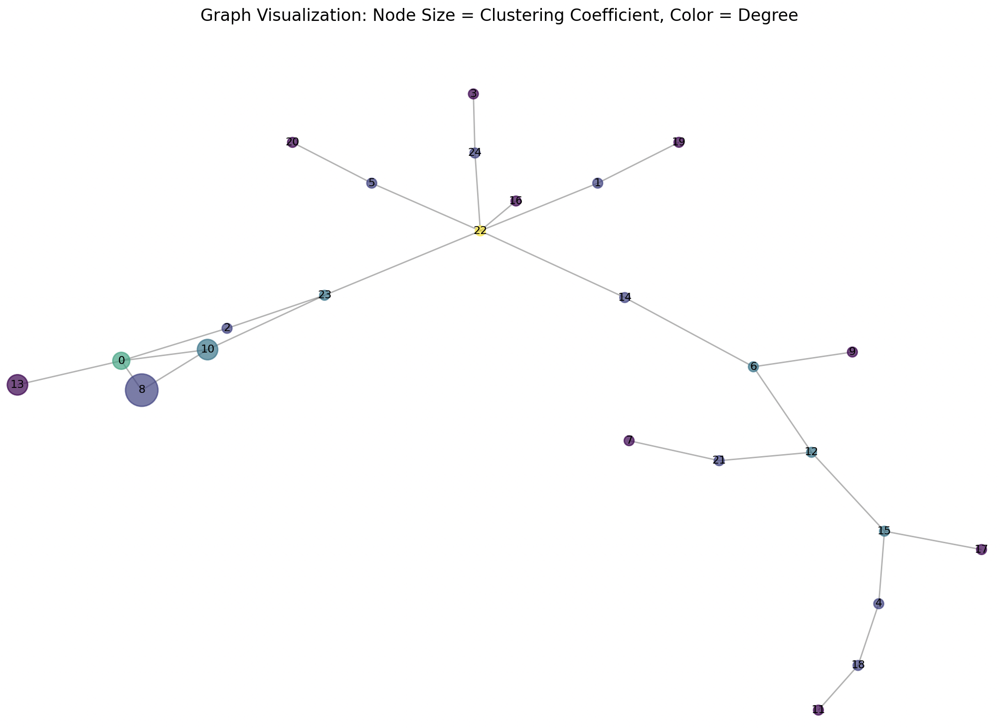
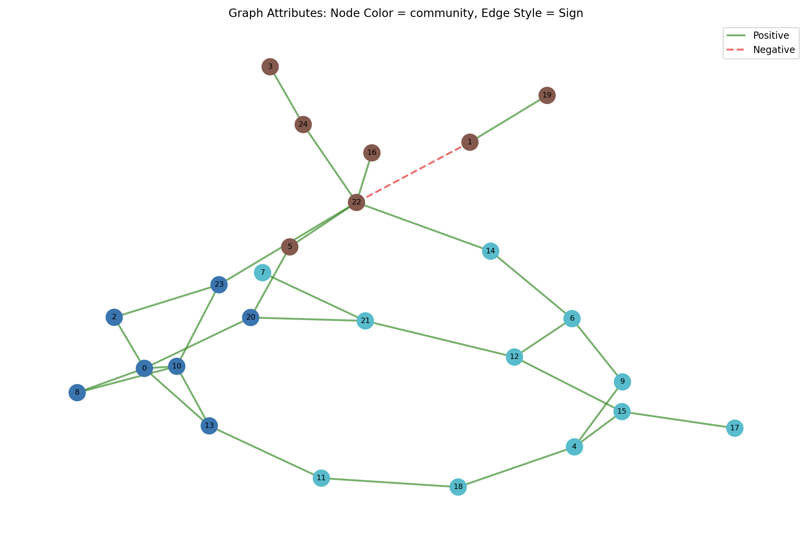

# Description

This project is bult upon the previous Erdos-Renyi Graph generation in order to add more functions to analyze a said graph.

The usage will consist of running flags and arguments in for executing certain tasks. Be sure to use an environment with all of the packages listed in `requirements.txt` present.

### Quick Examples
```bash
python ./graph_analysis.py --input data.gml --components 3 --plot C --simulate_failures 5 --output output.gml
python ./graph_analysis.py --input data.gml --plot T --temporal_simulation edges.csv
python ./graph_analysis.py --input data.gml --plot P --verify_homophily --verify_balanced_graph --output output.gml
```

### Screenshots
`python ./graph_analysis.py --input data.gml --components 3 --plot C --simulate_failures 5 --output output.gml`



`python ./graph_analysis.py --input data.gml --plot P --verify_homophily --verify_balanced_graph --output output.gml`



# Setup Instructions
1. Ensure python and pip are working on your machine.
2. Download or clone the repository (make sure you have `git` installed):
```bash
git clone https://github.com/tensofu/social-networks.git
cd social-networks
```
3. Create a new virtual environment within the project folder
```bash
# Create the virtual environment
python -m venv venv
```
4. Activate the virtual environment
```bash
# (on macOS/Linux)
source venv/bin/activate

# (on Windows via Command Prompt)
venv\Scripts\activate
```
5. Install the packages according to `requirements.txt`
```bash
pip install -r requirements.txt
```

# Project Architecture
`graph_analysis.py` is the main program to run for this assignment.
### Directories
- The `data/` directory will store the `.gml` files related to graph modelling.
  - `final_graph.*` or `output.gml` contains the final graphs that are specified by `--output`.
  - `data*.gml` files act as our graphs used for testing and for input.
- The `utils/` directory will contain all of the additional `.py` modules used for the program.
  - `helper.py` includes all of the implementation for each of the analysis tests as functions (multi-BFS, connected components, cycles, etc.)
- The `attachments/` directory simply serves images for `README.txt` to display.
