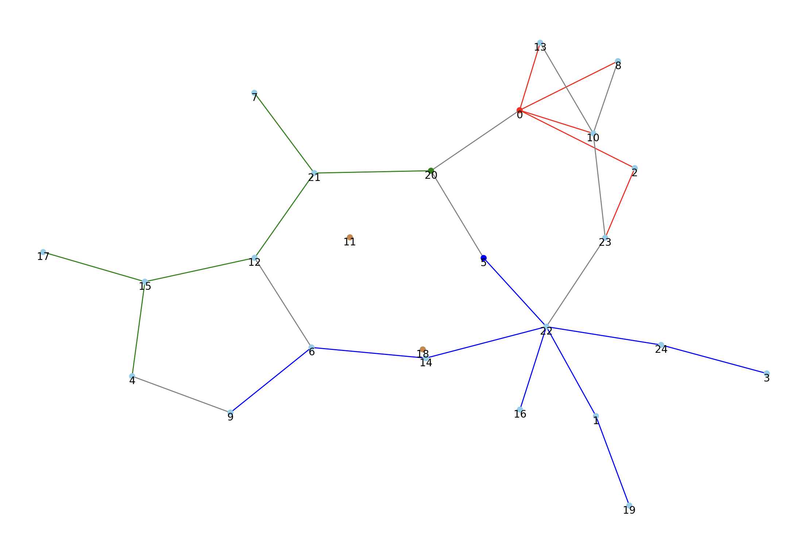

# Description

This project is done for a class assignment involving the generation and analysis of Erdos-Renyi randomized graphs. It will mainly be done in Python, and feature a GUI that displays the graphs, with terminal output which identifies cycles, connected components, and etc.

The usage will consist of running flags and arguments in for executing certain tasks. Be sure to use an environment with all of the packages listed in `requirements.txt` present.

We utilized primarily the following packages when developing this program:
- [networkx](https://networkx.org/): Used for graph representation, generation, I/O, and for multiple graph-related functions.
- [matplotlib](https://matplotlib.org/): Used to easily plot and visualize the graph.
- [argparse](https://docs.python.org/3/library/argparse.html): Used to perform commandline parsing through parameters and storing the arguments.
- [numpy](https://numpy.org/): Used as a dependency for other packages, and for fast mathematical operations.

### Quick Examples
```bash
python ./graph.py --create_random_graph 200 1.5 --multi_BFS 0 5 20 --analyze --plot --output final_graph.gml
python ./graph.py --create_random_graph 25 0.7 --multi_BFS 0 5 20 --analyze --plot --output data2.gml
python ./graph.py --input data.gml --analyze --plot
```

### Screenshots
`python ./graph.py --create_random_graph 200 1.5 --multi_BFS 0 5 20 --analyze --plot --output final_graph.gml`


`python ./graph.py --create_random_graph 25 0.7 --multi_BFS 0 5 20 --analyze --plot --output data2.gml`



# Setup Instructions
1. Ensure python and pip are working on your machine.
2. Download or clone the repository (make sure you have `git` installed):
```bash
git clone https://github.com/tensofu/ErdosRenyiGraphs.git
cd ErdosRenyiGraphs/
```
3. Create a new virtual environment within the project folder
```bash
# Create the virtual environment
python -m venv venv
```
4. Activate the virtual environment
```bash
# (on macOS/Linux)
source venv/bin/activate

# (on Windows via Command Prompt)
venv\Scripts\activate
```
5. Install the packages according to `requirements.txt`
```bash
pip install -r requirements.txt
```
6. Run some of the following commands to test it out:
```bash
python ./graph.py --create_random_graph 200 1.5 --multi_BFS 0 5 20 --analyze --plot --output final_graph.gml
python ./graph.py --input data.gml --analyze --plot
python ./graph.py --input graph_file.gml --create_random_graph 200 1.5 --multi_BFS 0 5 20 --analyze --plot --output final_graph.gml
python ./graph.py --input graph_file.gml --create_random_graph 200 1.5 --multi_BFS 0 5 20 --analyze --plot --output final_graph.txt
python ./graph.py --create_random_graph 6 0.4 --multi_BFS 0 2 --analyze --plot --output data.gml
```

# Usage
To start the program, use the following commandline structure: `python ./graph.py [--input graph_file.gml] [--create_random_graph n c] [--multi_BFS a1 a2 ...] [--analyze] [--plot] [--output out_graph_file.gml]`
- `[--input graph_file.gml]` specifies an existing `.gml` file the program should read in (overwritten if `--create_random_graph` is present).
- `[--create_random_graph n c]` creates a new Erdos Renyi graph with `n` nodes andu ses constant `c` to calculate `p`.
- `[--multi_BFS a1 a2 ...]` performs a multi-BFS search starting at specified source nodes `a1`, `a2`, etc.
- `[--analyze]` performs multiple analysis functions related to the graph generated/passed.
- `[--plot]` visualizes the plot of the graph using matplotlib
- `[--output out_graph_file.gml]` saves the graph in `data/out_graph_file.gml`, with whatever name was specified.
- `[--seed <int>]` defines an optional seed to pass into the function for reproducibility (default `42`)

# Project Architecture
`graph.py` is the main entry point for the program.
### Directories
- The `data/` directory will store the `.gml` files related to graph modelling.
  - `final_graph.*` contains the final graphs that are specified by `--output`.
  - `data*.gml` files act as our graphs used for testing.
- The `utils/` directory will contain all of the additional `.py` modules used for the program.
  - `helper.py` includes all of the implementation for each of the analysis tests as functions (multi-BFS, connected components, cycles, etc.)
- The `attachments/` directory simply serves images for `README.txt` to display.
